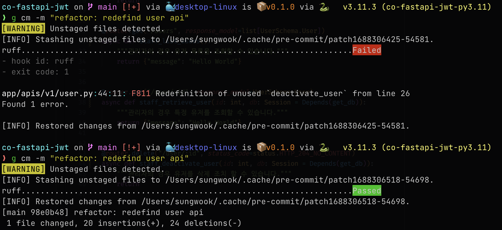

# co-fastapi-jwt

- jwt 아키텍트 구조를 만들기 위한 연습용레포

## 사용할 기술
general
- formatter: black, isort
- linter: Ruff
- typechecker: pyright
- WAS: FastAPI
- CI: github action
- CD: github action
- DB: postgres
- IDE: vscode

python
- python version management: pyenv
- python venv management: poetry
- env management: python-dotenv

jwt
- access token storage: localStorage
- refresh token storage: HttpOnlyCookies

dns
- domain managemet: namecheap
- https certificate: letsencrypt
- cloud vender: digital ocean

diagram
- erd: dbcloud


## settings

### pre-commit
1. `brew install pre-commit` 을 통해 pre-commit 을 OS에 설치합니다.
   - `pre-commit -V` 를 통해 설치를 확인할 수 있습니다. 
2. repo 에서 `pre-commit install` 을 통해 .git 폴더안에 hook 을 설치합니다.
   - `pre-commit run` 을 통해 동작을 확인 할 수 있습니다.

### ruff
python linter 툴입니다. (pylint를 대체 합니다.)
pyproject.toml 에 해당 설정을 넣습니다.
- pre-commit 으로 사용합니다. (F401은 무시)
- ci test 로 사용합니다. (두번 검사하는 것에 대해 추후에 하나를 없앨 수 있습니다.)
 
 그러나 아직까지 ruff가 pylint를 대체하기 어려워 보입니다.
pylint가 제공하는 정보에 비해 ruff의 디버깅 정보가 많이 부족해 보입니다. (redefined-outer-name 등)
ruff 는 속도가 빠르므로 main 이외의 브랜치나 pre-commit 으로 이용하는 게 좋을 것 같음

일단 어떤 에러를 방지할 수 있는지에 대해 검사하기 위해서 pre-commit 세팅은 했지만, 아직 사용 용도는 검증 안됨



실제로 간단한 오류에 대해서 매우 빠르게 확인, 검증가능함
파일이 저장될 때마다 호출 할 수도 있을 것으로 보임 

 ### .vscode(black, isort)
다음과 같은 설정을 사용합니다.
```json
{
    "isort.args": ["--profile", "black"],
    "python.formatting.provider": "black",
    "black-formatter.args": ["--line-length", "88", "--extend-exlucde", "alembic"],
}
```

### workflows(pylint)
- 여러가지 디버그를 도와줄 수 있는 pylint 관련 
- github action 에서 poetry shell 이나, source 시에도 pylint를 못 찾아서 requirements 로 리스트화 해서 설치하는 형식으로 우회  


### github action flows
pylint 가 체크하는데 시간이 오래 걸리기 때문에, app 디렉토리가 변경되었을 떄만 실행되도록 변경
